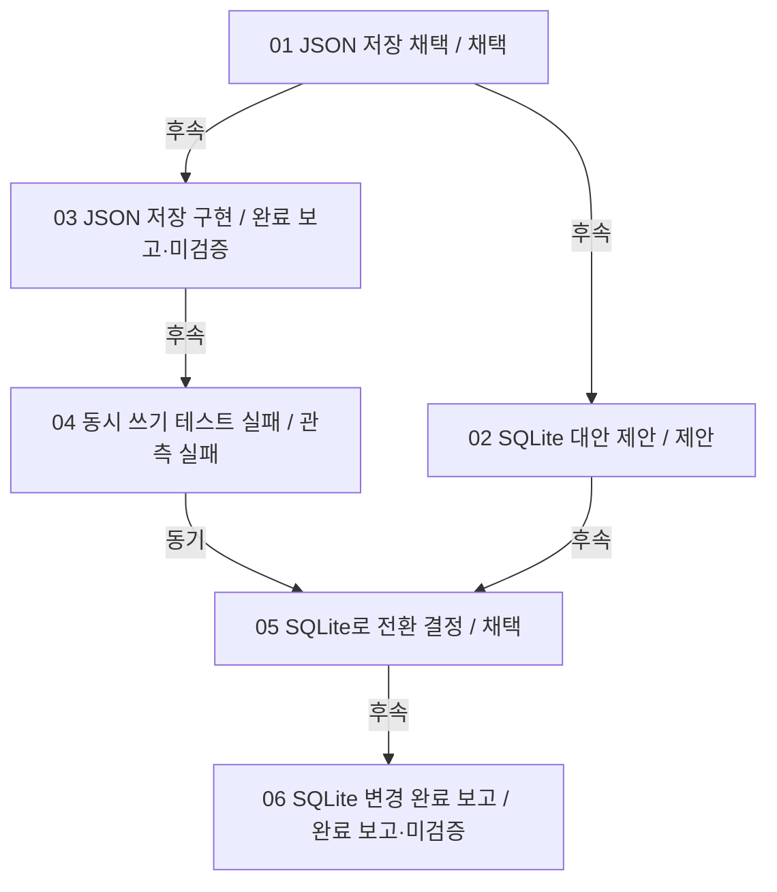

# Project Flow

> 민감한 대화·코드가 포함될 수 있습니다. 공유 전에 확인하세요.

그래프 버전: 2 · 분석 기준: 2026\-09\-22T12:11:42\+00:00

## 사건과 근거

### 01. JSON 저장 채택

우선 JSON 파일로 저장하자\.

상태: 채택 · 근거 수준: explicit\_statement
ID: `ev_07c659776aae32b5cd17f767`

근거 `evi_c4532aab5162e8967673bc88` · `src_839ee34c948caf4194f7c8f3` · 줄 1–1

~~~~text
우선 JSON 파일로 저장하자.
~~~~

### 02. SQLite 대안 제안

SQLite도 검토할 수 있습니다\.

상태: 제안 · 근거 수준: explicit\_statement
ID: `ev_232d84c7e2db480ff70605fd`

근거 `evi_35a4c3d6167f45c97f606b7a` · `src_847b527dfd30542c1c6b4e2b` · 줄 1–1

~~~~text
SQLite도 검토할 수 있습니다.
~~~~

### 03. JSON 저장 구현

JSON 저장 코드 patch 적용 완료\.

상태: 완료 보고·미검증 · 근거 수준: tool\_record
ID: `ev_315a199124d73e4b60a64f50`

근거 `evi_e08f83a8bfd14b7666e86406` · `src_712612d7420ff8ee3702a0f8` · 줄 1–1

~~~~text
JSON 저장 코드 patch 적용 완료.
~~~~

### 04. 동시 쓰기 테스트 실패

동시 쓰기 테스트: FAILED — JSONDecodeError

상태: 관측 실패 · 근거 수준: tool\_record
ID: `ev_14a049eca520e554f5482d1e`

근거 `evi_f1bc54afd7d7e8edfd2b7b17` · `src_3d77bd75d691e4466b402764` · 줄 1–1

~~~~text
동시 쓰기 테스트: FAILED — JSONDecodeError
~~~~

### 05. SQLite로 전환 결정

동시 쓰기 때문에 SQLite로 바꾸자\.

상태: 채택 · 근거 수준: explicit\_statement
ID: `ev_db1c5710614901ecec74ee43`

근거 `evi_7cfad278ae564a558ef37af6` · `src_d5b4116553d00a40e995e14f` · 줄 1–1

~~~~text
동시 쓰기 때문에 SQLite로 바꾸자.
~~~~

### 06. SQLite 변경 완료 보고

SQLite로 변경했고 테스트도 통과했습니다\.

상태: 완료 보고·미검증 · 근거 수준: explicit\_statement
ID: `ev_bdecbeb42d06df8a57a61a3d`

근거 `evi_df8d2b3234e4ae931bf687a2` · `src_6dd41ced977d266e61f38d37` · 줄 1–1

~~~~text
SQLite로 변경했고 테스트도 통과했습니다.
~~~~

## 관계와 연결 근거

### JSON 저장 채택 → SQLite 대안 제안

관계: follows · structural · 활성: True
합성 fixture에 명시된 순서/전환 이유
근거: `evi_35a4c3d6167f45c97f606b7a`

### JSON 저장 채택 → JSON 저장 구현

관계: follows · structural · 활성: True
합성 fixture에 명시된 순서/전환 이유
근거: `evi_e08f83a8bfd14b7666e86406`

### JSON 저장 구현 → 동시 쓰기 테스트 실패

관계: follows · structural · 활성: True
합성 fixture에 명시된 순서/전환 이유
근거: `evi_f1bc54afd7d7e8edfd2b7b17`

### 동시 쓰기 테스트 실패 → SQLite로 전환 결정

관계: motivates · explicit · 활성: True
합성 fixture에 명시된 순서/전환 이유
근거: `evi_7cfad278ae564a558ef37af6`

### SQLite 대안 제안 → SQLite로 전환 결정

관계: follows · structural · 활성: True
합성 fixture에 명시된 순서/전환 이유
근거: `evi_7cfad278ae564a558ef37af6`

### SQLite로 전환 결정 → SQLite 변경 완료 보고

관계: follows · structural · 활성: True
합성 fixture에 명시된 순서/전환 이유
근거: `evi_df8d2b3234e4ae931bf687a2`

## 전체 근거 색인

### `evi_35a4c3d6167f45c97f606b7a`

원문: `src_847b527dfd30542c1c6b4e2b` · 줄 1–1
\{"kind":"jsonl","line":3,"path":"/mnt/data/pf\-build/installed\-demo/fixture\-codex/sessions/demo\.jsonl","raw\_hash":"d4a6ee6df006a8fa63e76ad4aa3091649f84cb934720eafcf044f0dad7f19c62"\}

~~~~text
SQLite도 검토할 수 있습니다.
~~~~

### `evi_7cfad278ae564a558ef37af6`

원문: `src_d5b4116553d00a40e995e14f` · 줄 1–1
\{"kind":"jsonl","line":1,"path":"/mnt/data/pf\-build/installed\-demo/fixture\-claude/projects/demo/demo\-claude\.jsonl","raw\_hash":"65650fa3fbeb2a573d5f1db8e4f09171a6b8e7c2ce63edd5440ca4fabee65f79"\}

~~~~text
동시 쓰기 때문에 SQLite로 바꾸자.
~~~~

### `evi_c4532aab5162e8967673bc88`

원문: `src_839ee34c948caf4194f7c8f3` · 줄 1–1
\{"kind":"jsonl","line":2,"path":"/mnt/data/pf\-build/installed\-demo/fixture\-codex/sessions/demo\.jsonl","raw\_hash":"2e5a4fd6b607da642e3ef0421ab5029e0b721f847d8f4e29548daed545554164"\}

~~~~text
우선 JSON 파일로 저장하자.
~~~~

### `evi_df8d2b3234e4ae931bf687a2`

원문: `src_6dd41ced977d266e61f38d37` · 줄 1–1
\{"kind":"jsonl","line":2,"path":"/mnt/data/pf\-build/installed\-demo/fixture\-claude/projects/demo/demo\-claude\.jsonl","raw\_hash":"5c845128649fca7d525d9376b31c55d4454ef5ac5332f06e11f683cfdd62d3a7"\}

~~~~text
SQLite로 변경했고 테스트도 통과했습니다.
~~~~

### `evi_e08f83a8bfd14b7666e86406`

원문: `src_712612d7420ff8ee3702a0f8` · 줄 1–1
\{"kind":"jsonl","line":4,"path":"/mnt/data/pf\-build/installed\-demo/fixture\-codex/sessions/demo\.jsonl","raw\_hash":"d25de41670bc2a842d488bbb833d9e1b19d5233ceb7468b1311878ce728b046d"\}

~~~~text
JSON 저장 코드 patch 적용 완료.
~~~~

### `evi_f1bc54afd7d7e8edfd2b7b17`

원문: `src_3d77bd75d691e4466b402764` · 줄 1–1
\{"kind":"jsonl","line":5,"path":"/mnt/data/pf\-build/installed\-demo/fixture\-codex/sessions/demo\.jsonl","raw\_hash":"d3c534986d220c52befc6435905d5332c019ce3235d6f5eb2fe61aa89479bc17"\}

~~~~text
동시 쓰기 테스트: FAILED — JSONDecodeError
~~~~

## 한계

이 그래프는 합성 fixture와 Mock Runner로 생성했습니다\. 실제 AI 복원 정확도를 나타내지 않습니다\.
Git 저장소가 아니므로 Git 근거는 없습니다\.
